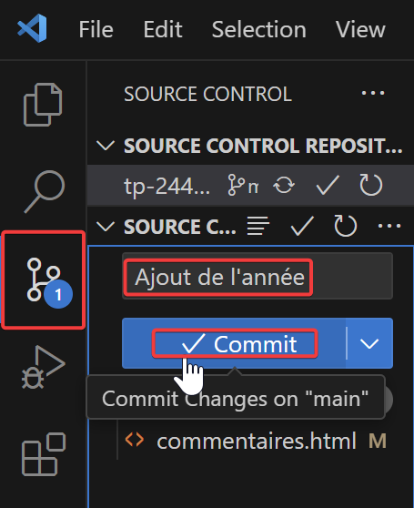
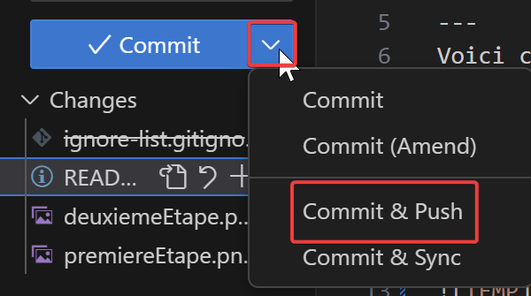

# Travail Pratique 2
---
Ce dépôt contient le code d’un projet web fait dans le cours de Perspective Professionnelles.
## Faire un *commit* et un *push* dans *Visual Studio Code*
---
Voici comment faire un changement sur ce projet, et l’envoyer sur GitHub.
1. Aller dans l'onglet "Source Control" de Visual Studio Code
2. Cliquer sur les 3 points de suspension de "SOURCE CONTROLE REPOSITORIES" et cliquer sur pull
3. Écrire brièvement les modifications dans "SOURCE CONTROL"
4. Cliquer sur le menu déroulant du bouton bleu et cliquer sur "Commit & Push"

## Contributeurs
---
- Justin Duchesne -Auteur principal
## Liscence
---
Copyright @ 2024 Justin Duchesne. Tous droits réservés.

